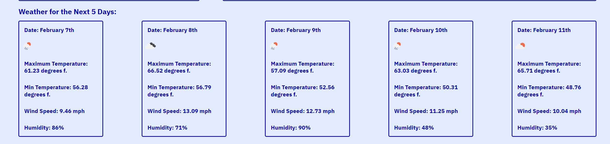

# WeatherStation

This Weather Station will prompt you for an input - a city you would like to view the weather for.

Upon entering the city name and pressing enter or clicking "Get the Weather!" you will see the current weather. Upon a slight scroll down, you will see the five day forecast for that city. 

Additionally, we will store the cities you have searched for so that you can quickly retrieve that weather again by pressing on that city name under "Previous Cities:"

https://github.com/JLewis1995/WeatherStation
https://jlewis1995.github.io/WeatherStation/

